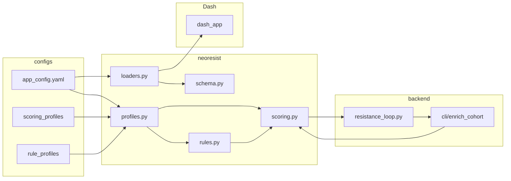

# NeoResist-MD architecture

## Overview

## Core modules (`neoresist/`)

| Module | Responsibility |
|--------|----------------|
| `paths.py` | Repo root, `configs/` path |
| `config.py` | Load `configs/app_config.yaml` (branding, defaults, cohort search paths) |
| `profiles.py` | Load scoring / rule YAML into dataclasses |
| `scoring.py` | `apply_resistance_loop_engine` — weighted RL score, blend toward real TPM/CCF, **no eval** |
| `rules.py` | Tier thresholds from rule profile |
| `schema.py` | Explicit column synonyms + `validate_dash_columns` |
| `loaders.py` | `load_cohort_for_dash` — env path, config search list, CSV/Parquet/XLSX, rich errors |
| `metadata.py` | Stamp `dataset_name`, `app_version` on enriched outputs |
| `canonical_schema.py` | Load the canonical long-format table contract and materialize append-only module outputs |
| `module_schema.py` | Load the prompt-aligned module registry from YAML |
| `case_store.py` | Persist cases, manifests, artifacts, audit events, and module checkpoint metadata |
| `module_runner.py` | Resume-safe orchestration of background module workers |
| `case_worker.py` | Per-module execution entrypoint writing persisted artifacts to disk |
| `case_ui.py` | Expert/Simple case rendering for persisted module workflows |
| `ops_status.py` | Summarize persisted runtime state for the pipeline status panel |
| `dash_app/` | Dash layout, callbacks, data cache helpers |

## Data flow

1. **Enrich:** `join_tcga_metadata` → purity → expression → clonality → `apply_resistance_loop` (wraps engine) → provenance → `stamp_enrichment_metadata` → Parquet.
2. **Dash:** Callbacks call `load_cohort_for_dash` (or cache-aligned `seed_cache`), filter/aggregate, Plotly/AgGrid.
3. **Case workflow:** upload → persisted case manifest → background module workers → canonical/module artifacts on disk → Expert/Simple case view reads saved state without recomputation.

## Scoring Formula

Canonical ResistanceLoop scoring uses:

`rl_priority = immunogenicity_blend × (1 − resistance_penalty)`

- `immunogenicity_blend` is the weighted combination of:
  - `expression_norm`
  - `presentation`
  - `ccf`
  - `self_dissimilarity`
- `resistance_penalty` is the normalized escape/LOH term derived from `escape_penalty` and bounded to `[0, 1]`.
- Weights come from scoring profile YAML files in `configs/scoring_profiles/` (loaded via `neoresist.profiles` and applied by `neoresist.scoring.apply_resistance_loop_engine`).
- `rl_calibrated` is an evidence-derived strategy profile in `configs/profiles/rl_calibrated.yaml`; it is generated by logistic regression over `backend/validation/artifacts/training_matrix.csv`, with features `expression_score`, `presentation_score`, `ccf_score`, `self_dissimilarity_score`, and `escape_penalty`.

## Hybrid module runtime

- Supported local modules:
  - `neoantigen_generation`
  - `expression_join`
  - `resistance_loop`
  - `strategy_engine`
  - `prioritization_tiering`
- Conditional local/external module:
  - `clonality_pyclone_vi`
- Explicit unavailable placeholders:
  - `presentation_netctlpan`
  - `escape_lohhla`
  - `recognition_foreignness`

Each module persists:
- `status.json`
- checkpoint metadata (`checkpoint_label`, `resume_ready`, `attempt_count`)
- artifacts under the case module directory
- audit events in the case audit log

## Adding a scoring profile

1. Add `configs/scoring_profiles/<id>.yaml` (see `rl_v1.yaml` for fields).
2. Optionally set `defaults.scoring_profile_id` in `app_config.yaml` or pass `--scoring-profile <id>` to `enrich_cohort`.
3. Run `python -m unittest backend.tests.test_rl_v1_parity` after changing `rl_v1`; add a new parity test if you fork RL math.

## Adding a rule profile

1. Add `configs/rule_profiles/<id>.yaml` with `tier_thresholds.tier1_above` / `tier2_above`.
2. Reference it via `defaults.rule_profile_id` or `--rule-profile`.

## Adding a dataset descriptor

1. Add `configs/datasets/<name>.yaml` (documentation; search paths live in `app_config.yaml` `cohort.search_paths`).
2. Use `--dataset-name` on enrich or rely on `defaults.dataset_id`.

## Provenance / versioning

- Rows: `scoring_profile`, `scoring_version`, `rule_profile`, `dataset_name`, `app_version`.
- UI: footer shows app version; methodology expander summarizes active profile (when config loads).

## Tests

- `backend/tests/test_rl_v1_parity.py` — engine vs frozen `rl_v1_reference` implementation.
- `backend/tests/test_neoresist_loaders.py` — loader error messages list searched paths.
